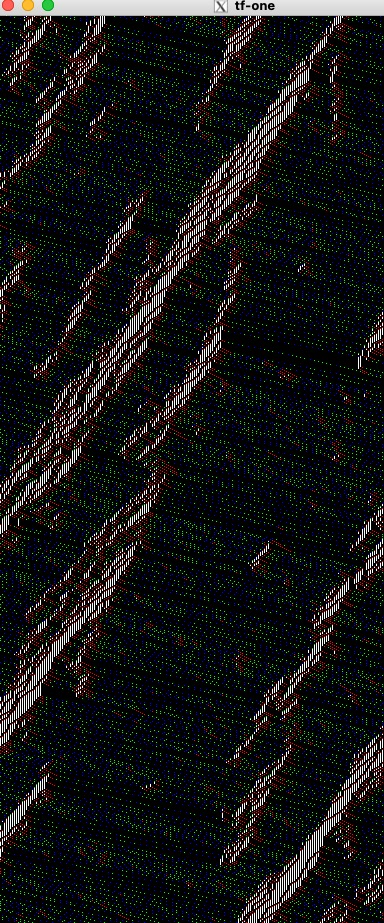

This code simulates one-dimensional traffic flow CA [1].  It uses [GSL](https://www.gnu.org/software/gsl/) for the random number generator and [EGGX](https://www.ir.isas.jaxa.jp/~cyamauch/eggx_procall/index.html) for graphics. To compile the code, type 'make' in the program directory.

Since the calculations are processed too fast, we intentionally delay it for 30000 microseconds at every CA update step by putting 'usleep(30000);' in main.c.

The figure shows the time lapse of one-dimensional traffic flow CA. Under the cyclic boundary condition, the cars move left to right. The colors represent their velocities, and the white parts represent traffic jams. We can see the jams' backpropagation, a shockwave propagation induced by the jam. This figure was created by calling the 'egg_traffic()' function in 'main.c'.

A real-time state of the system can be displayed by enabling the 'egg_disp();' in 'main.c'.

[1] [A cellular automaton model for freeway traffic](https://hal.science/jpa-00246697/document)

